# Feature diagrams

> Repository status: `https://github.com/Defani/gayo-baseline-gis-toolkit` is currently empty. The plugin source has not been pushed there yet - the diagrams below describe the local codebase and are ready to drop into the README once the repository is populated.

## 0. System architecture

How the toolkit is wired together end to end: plugin bootstrap, the single sidebar panel, the per-tool modules, and the external systems each one talks to.

### 0.1 Component overview

```mermaid
flowchart TB
    subgraph HOST["QGIS Desktop (host application)"]
        TB["Toolbar icon / Plugins menu action"]
        PB["agroforestry_gis_toolkit_plugin.py<br/>(classFactory entry point, initGui, unload)"]
        DOCK["QDockWidget<br/>(right dock area)"]
        PANEL["sidebar_panel.py: SidebarPanel<br/>QStackedWidget - menu page + cached tool pages"]
        PROC["Processing Toolbox<br/>GridIndexProvider (QgsProcessingProvider)"]
        CANVAS["QGIS Project / Map Canvas<br/>(layers, attribute tables, map tips)"]
    end

    subgraph TOOLS["Tool dialogs (UI layer, one QWidget per tool)"]
        T1[AddLayerDialog]
        T2[BasemapSearchDialog]
        T3[QuickQueryDialog]
        T4[GeeDialog]
        T5[DistanceDialog]
        T6[ExportDialog]
        T7[DbExportDialog]
        T8[KoboDialog]
        T9[FotoExplorerDialog]
        T10[FotoLayerDialog]
        T11[GpxDialog]
        T12[GridIndexDialog]
    end

    subgraph LOGIC["Business logic / connector modules (no Qt, mostly testable in isolation)"]
        L1[ows_utils.py]
        L2["QMS: quick_map_services<br/>(external plugin)"]
        L3[qgis native expressions]
        L4[gee_connector.py]
        L5[distance_processor.py]
        L6[exporter.py]
        L7[db_exporter.py]
        L8[kobo_connector.py]
        L9[foto_layer_utils.py]
        L10[gpx_processor.py + processing.run]
        L11[grid_index_algorithm.py]
    end

    subgraph EXTERNAL["External systems and formats"]
        E1["OGC XYZ / WMTS / WMS / WFS servers"]
        E2["QuickMapServices basemap catalog"]
        E3["Google Earth Engine platform"]
        E4["Forest/kawasan reference layer (local)"]
        E5["CSV / GeoJSON / XLSX files"]
        E6["PostGIS / Supabase database"]
        E7["KoboToolbox REST API"]
        E8["GPX file (Garmin)"]
        E9["GDAL/OGR + native Processing algorithms"]
    end

    TB --> PB --> DOCK --> PANEL
    PB --> PROC
    PANEL -->|"_open_tool(key, dialog_cls)<br/>creates once, caches in _pages"| T1 & T2 & T3 & T4 & T5 & T6 & T7 & T8 & T9 & T10 & T11 & T12

    T1 --> L1 --> E1
    T1 -.-> L4
    T2 --> L2 --> E2
    T3 --> L3
    T4 --> L4 --> E3
    T5 --> L5 --> E4
    T6 --> L6 --> E5
    T7 --> L7 --> E6
    T8 --> L8 --> E7
    T9 --> L8
    T10 --> L9 --> E7
    T11 --> L10 --> E9 --> E8
    T12 --> L11
    PROC --> L11

    T1 & T3 & T5 & T6 & T7 & T8 & T9 & T10 & T11 & T12 -->|"finished signal<br/>adds/updates layer"| CANVAS
    L11 -->|"output grid layer"| CANVAS
```

### 0.2 How opening a tool works (sidebar lifecycle)

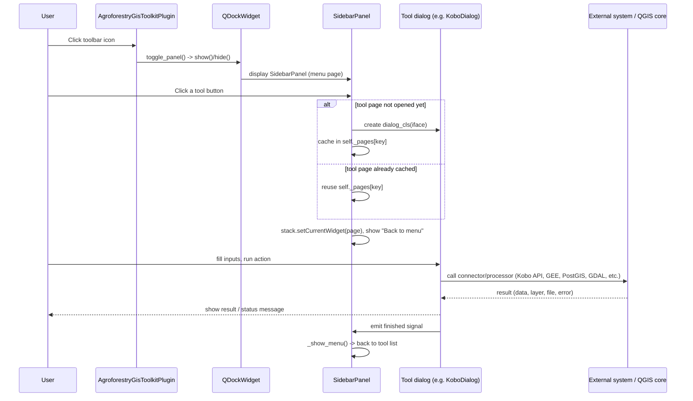

### 0.3 What each layer is responsible for

| Layer | Files | Responsibility |
| --- | --- | --- |
| Bootstrap | `__init__.py`, `agroforestry_gis_toolkit_plugin.py` | QGIS entry point (`classFactory`), toolbar/menu action, dock widget lifecycle, Processing provider registration |
| Panel/navigation | `sidebar_panel.py` | Single dockable panel; menu list of tools; lazily creates and caches each tool's widget in a `QStackedWidget`; handles "Back to menu" |
| UI layer | `*_dialog.py` | One `QWidget`/`QDialog` per tool; collects user input, shows status/progress, emits `finished` when done |
| Business logic | `*_processor.py`, `*_connector.py`, `*_utils.py`, `exporter.py`, `db_exporter.py` | Pure(ish) Python functions that do the actual work: HTTP calls, geometry math, file writing - kept separate from Qt so they are easier to test |
| QGIS core integration | `qgis.core` / `qgis.gui` objects (`QgsVectorLayer`, `QgsProject`, `QgsSpatialIndex`, `QgsVectorFileWriter`, ...) | Represent and persist layers, run coordinate transforms, write output files, register the Processing algorithm |
| External systems | KoboToolbox API, Google Earth Engine, OGC WMTS/WMS/WFS servers, QuickMapServices catalog, PostGIS/Supabase, GDAL/OGR, filesystem | Everything outside the plugin/QGIS process that data is pulled from or pushed to |

Each diagram below reflects the actual code flow of that individual tool (dialog -> processing module -> QGIS API), and fits into the architecture above as one branch under `LOGIC`/`EXTERNAL`.

## 1. Kobo Connect

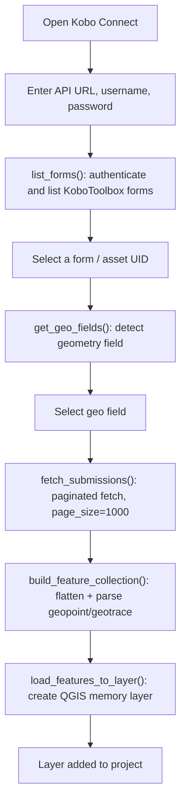

## 2. Foto di Layer (Kobo)

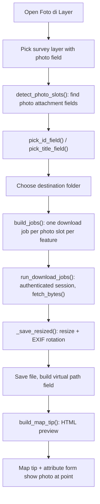

## 3. Foto Explorer (Kobo)

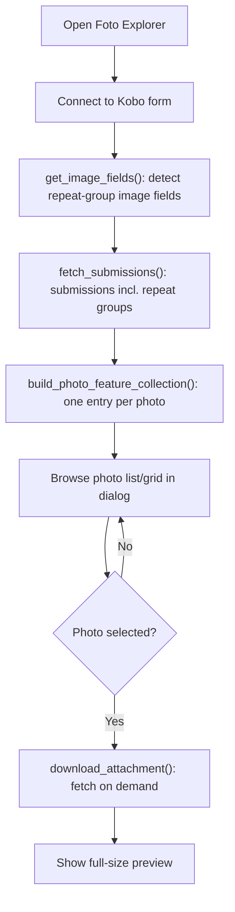

## 4. Quick Query

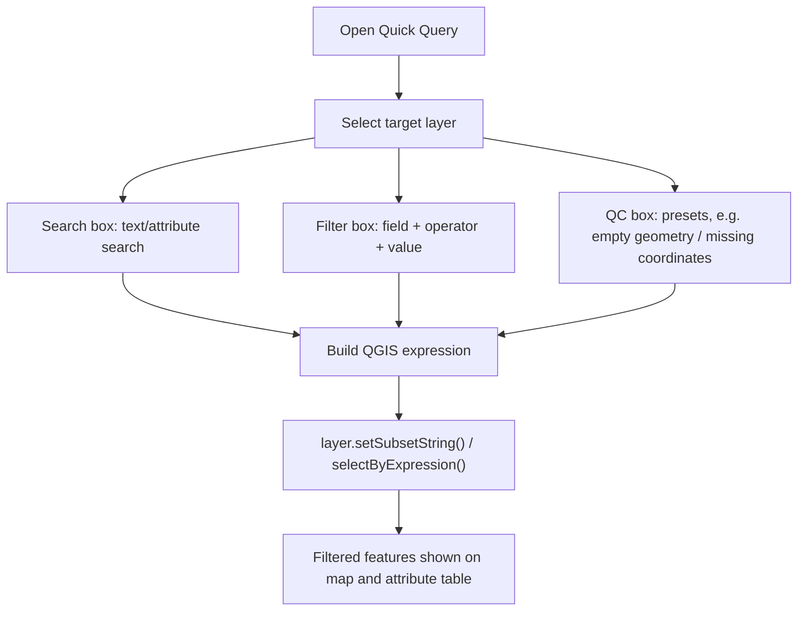

## 5. Distance Analysis

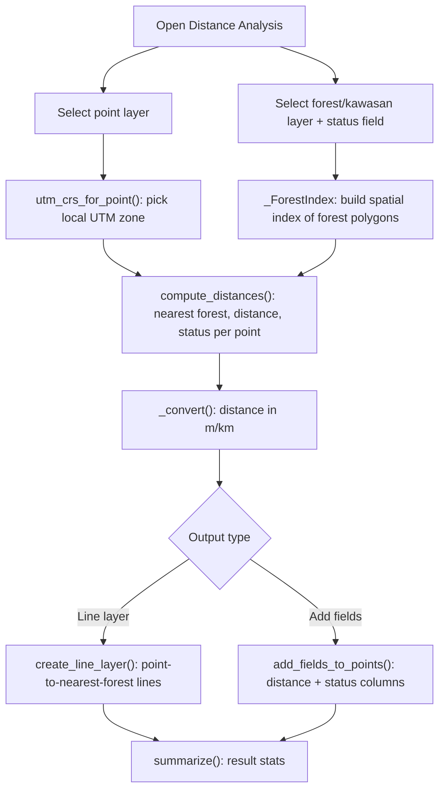

## 6. Export Data (Excel / GeoJSON / CSV)

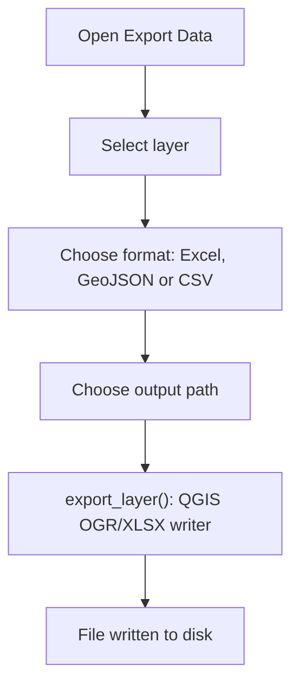

## 7. Export to Database (PostGIS / Supabase)

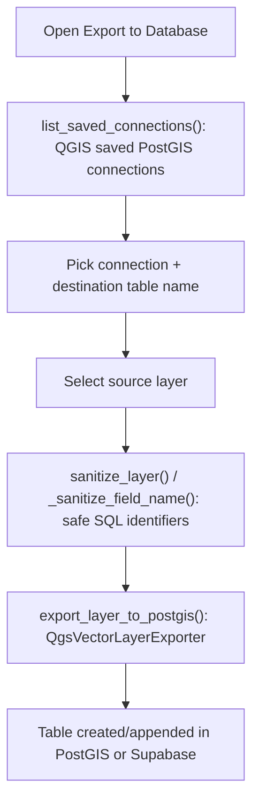

## 8. Add Layer (Tiles / WMTS / WMS / WFS / File / GEE)

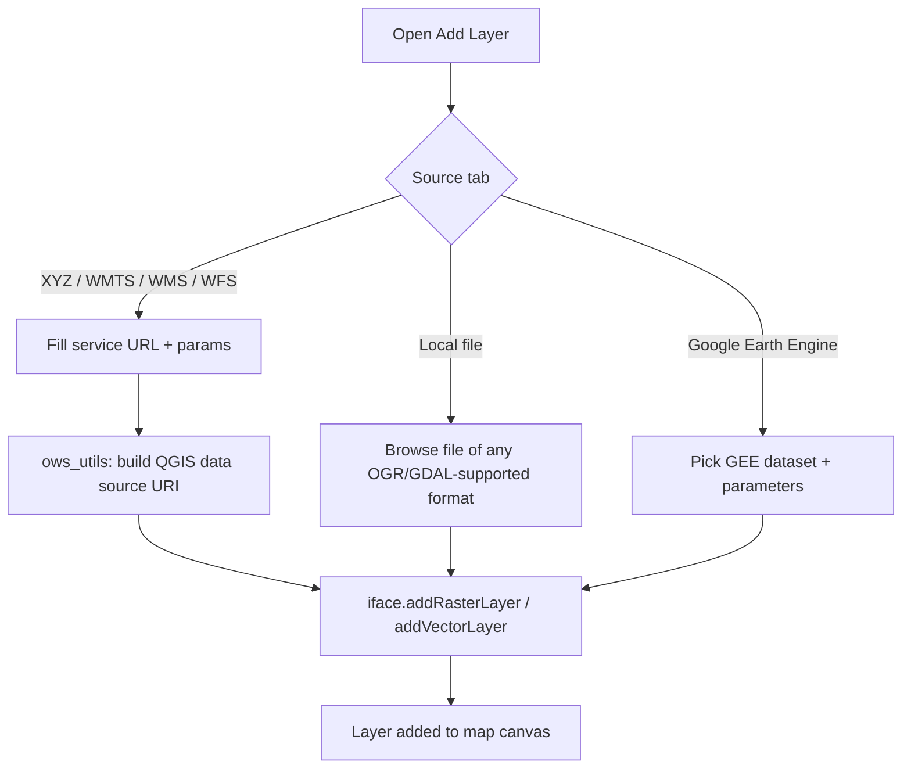

## 9. Basemap Search (QMS)

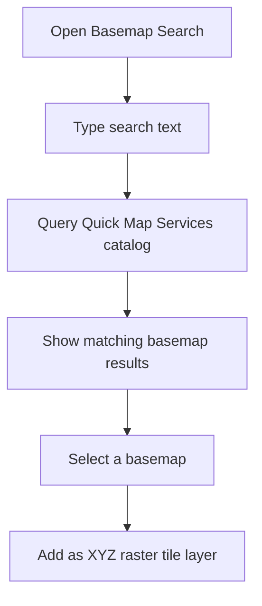

## 10. GEE Connect (Google Earth Engine)

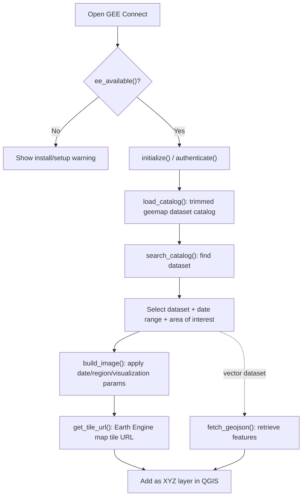

## 11. Export to GPX (Garmin)

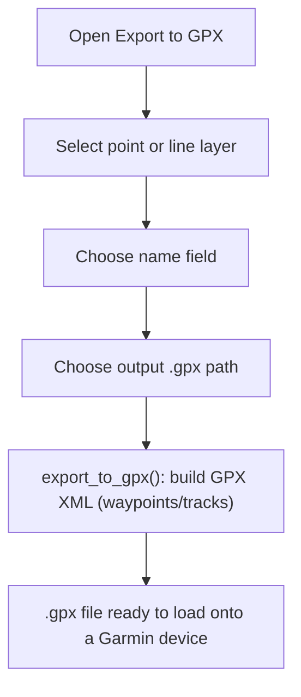

## 12. Grid Index

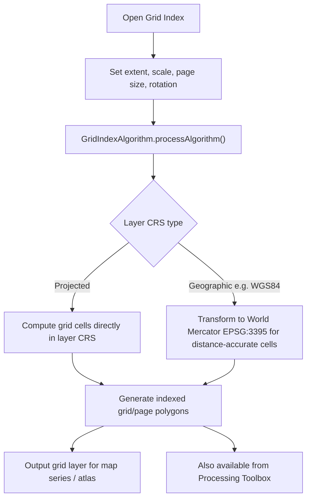
